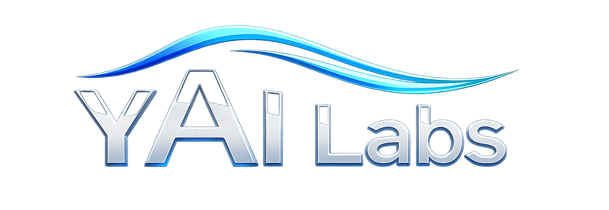

  

  
  
  
  
  
  
  

  <a href="https://github.com/yailabs/yai"><code>yai</code></a>
  ·
  <a href="https://github.com/yailabs/api"><code>api</code></a>
  ·
  <a href="https://github.com/yailabs/sdk"><code>sdk</code></a>
  ·
  <a href="https://github.com/yailabs/catalog"><code>catalog</code></a>
  ·
  <a href="https://github.com/yailabs/cli"><code>cli</code></a>
  ·
  <a href="https://github.com/yailabs/loom"><code>loom</code></a>

<h3 align="center">Controlled Machine Action.</h3>

Controlled machine action is the operating problem behind the next generation of AI systems.

As software moves from assistance to execution, the critical question is no longer whether a model can produce a useful answer. The question is whether a machine-driven action can be authorized, constrained, observed, interrupted, reviewed, evidenced, and improved without losing operational context.

YAI Labs builds around that boundary.

The ecosystem combines runtime infrastructure, governance material, API and SDK contracts, and operator-facing clients into a controlled foundation for intelligent action. The purpose is not to wrap models with another interface, or to document governance after the fact. The purpose is to make action itself a managed system surface.

That means treating execution as something that can carry structure: intent, permission, state, evidence, supervision, consequence, and memory. It also means giving future agents and automations a place to operate that is neither an unbounded chat surface nor a disconnected workflow script.

The work is active, modular, and deliberately staged. The repositories in this organization represent one technical program: building the infrastructure needed for machines to act under judgment before they are allowed to act at scale.

 

  <code>YAI Ain’t Intelligence · First Judge. Then Dream.</code>

